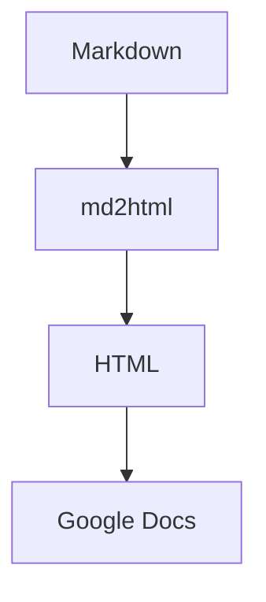

# Kitchen Sink

A fixture that exercises every supported construct. Run `md2html fixtures/kitchen-sink.md`
and paste the result into a Google Doc to verify formatting survives.

## Text formatting

This paragraph has **bold**, *italic*, ***bold italic***, ~~strikethrough~~, and
`inline code`. Here is an autolinked URL: https://example.com and an
[explicit link](https://www.google.com "Google").

## Lists

- Top level item
  - Nested item
    - Deeper nested item
- Another top level item

1. First
2. Second
   1. Second-A
   2. Second-B
3. Third

### Task list

- [x] Implement conversion
- [x] Inline local images
- [ ] Render diagrams (deferred to v2)

## Table

| Feature        | Survives Docs paste? | Notes                       |
|----------------|----------------------|-----------------------------|
| Headings       | Yes                  | All levels                  |
| Tables         | Yes                  | Becomes a real Docs table   |
| Local images   | Yes                  | Inlined as base64           |
| Code blocks    | Yes                  | Color highlighting may drop |

## Blockquote

> The simplest solution that solves the problem wins.

## Code block

```js
function greet(name) {
  return `Hello, ${name}!`;
}
```

## Local image


## Remote image


## Footnote

Markdown supports footnotes[^1] for citations.

[^1]: This is the footnote text.

## Mermaid (expected: stays a code block in v1)


